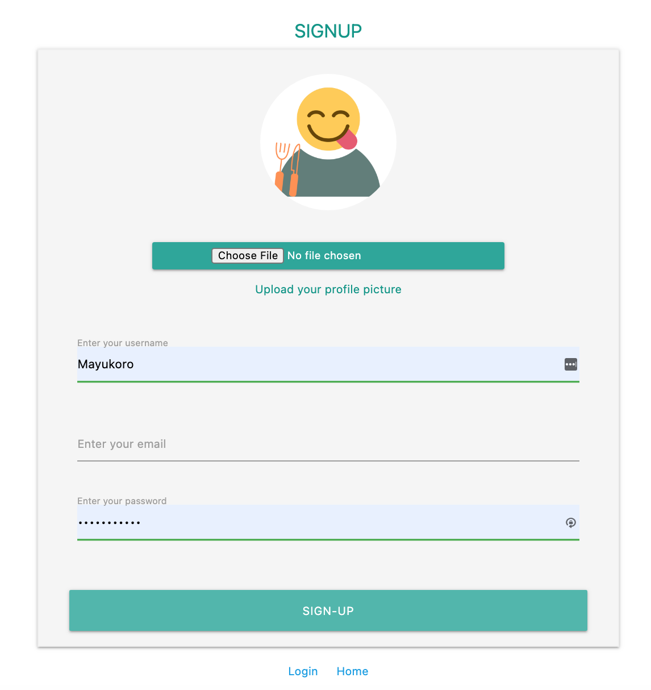

# Yummy-Finder

## Find Cooking Reciepes & Save to Make a Shopping List!

### Available on desktop size

  <a href="https://yummy-finder.web.app/">
    yummy-finder.web.app/
  </a>
 

 Javascript + Firebase (Authentication + Firestore + Storage) App 
 Using Spoonacular API 
  <a href="https://spoonacular.com/food-api/docs">Spoonacular API</a> 
 Project Duration: 4 weeks  

### Summary

Do you love to cook & want to get ideas for today's meal?
You can find your favorite recipes with your preferences such as vegetarian, gluten-free!

After logging in, save recipes to make a shopping list by clicking the ingredients you want to buy.

Also enjoy cooking videos on this website.

---

<!-- PROJECT LOGO -->

### Home

    

 

### Signup/ Login Function

    
    

### Recipe Search

Search Recipes after your preferences 

  

 

### Make a Shopping List

| Save Ingredients from your saved recipes                                  |                   See your shopping list and organize                   |
| ------------------------------------------------------------------------- | :---------------------------------------------------------------------: |
|  |  |

### Search for a Cooking Video

  

