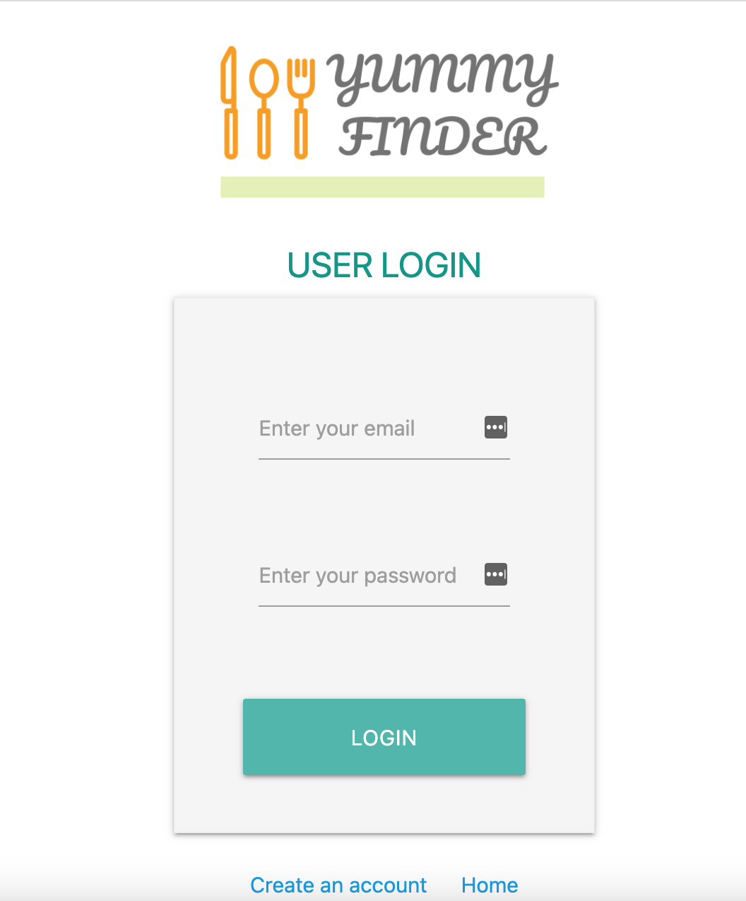

# Yummy-Finder

## Find Cooking Reciepes & Save to Make a Shopping List!

### Available on desktop size

  <a href="https://yummy-finder.web.app/">
    yummy-finder.web.app/
  </a>
 

 Javascript + Firebase (Authentication + Firestore + Storage) App 
 Using Spoonacular API 
 Project Duration: 4 weeks  
 <a href="https://spoonacular.com/food-api/docs">Spoonacular API</a> 

### Summary

Do you love to cook & want to get ideas for today's meal?
You can find your favorite recipes with your preferences such as vegetarian, gluten-free!

After logging in, save recipes to make a shopping list by clicking the ingredients you want to buy.

Also enjoy cooking videos on this website.

---

<!-- PROJECT LOGO -->
 

    

    
     

### Home Page / Recipes Search

| Jump to the page you want to visit by clicking the buttons   |              Search Recipes after  your preferences              |
| ----------------------------------------------------------------- | :-------------------------------------------------------------------: |
|  |  |

 

### Save Recipes & Ingredients/ Search for cooking videos

| Save your favorite recipes                                              |            Input search term to   find cooking videos            |
| ----------------------------------------------------------------------- | :------------------------------------------------------------------: |
|  |  |

---
